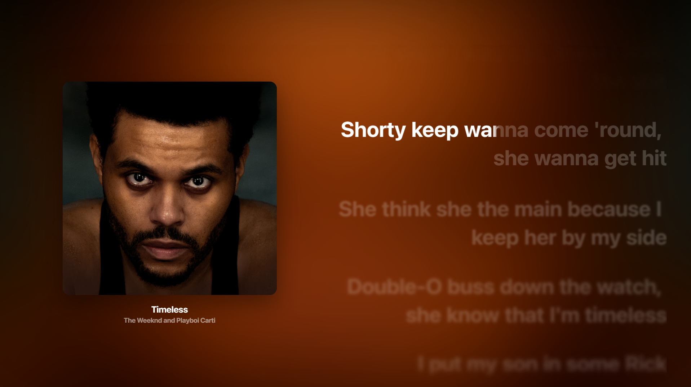

# 🌑 Darky — Premium Glass Theme for YouTube Music

> A sleek, dark glass-morphism theme for YouTube Music with smooth animations and an immersive visual experience.

---

## 📸 Screenshots




---

## ✨ Features

| Feature | Description |
|---------|-------------|
| 🌫️ **Glass Morphism UI** | Frosted glass effect on navbar, sidebar, player bar, and all menus |
| 🎨 **True Dark Aesthetic** | Deep blacks with subtle transparency for a premium look |
| 🔍 **Seamless Search** | Glass-integrated search dropdown with smooth transitions |
| 📜 **Scroll-Proof Sidebar** | Persistent frosted glass navigation that stays clean while scrolling |
| 🎵 **Immersive Player** | Full-screen layout with dynamic background and smooth panel transitions |
| 🎤 **Lyrics Engine** | Apple Music-inspired progressive blur with word-by-word highlighting |
| 🎛️ **Floating Player Bar** | Bottom glass bar with hover effects and smooth controls |
| ⚡ **Smooth Animations** | Hover lifts, scale effects, fade-ins, and elastic transitions throughout |
| 🖼️ **Dynamic Thumbnails** | Scale and darken effects on album art hover |
| 🍎 **Apple-Style Tabs** | Custom SVG icons for Queue, Lyrics, Comments, and Autoplay tabs |
| 📱 **Responsive Design** | Adapts cleanly across different screen sizes |

---

## 🎬 Animation Highlights

### UI Animations
- **Navbar** — Slide-down fade-in on page load
- **Sidebar Items** — Staggered fade-in from left
- **Cards** — Fade-in-up with hover lift effect
- **Buttons** — Scale bounce on hover, shrink on click
- **Menus** — Scale-in pop with glass blur backdrop
- **Queue Items** — Staggered slide-in from right
- **Player Bar** — Slide-up entrance animation
- **Skeleton Loaders** — Shimmer effect while content loads

### Lyrics Animations
- **Active Line** — Clears blur, scales up, glows white
- **Past Lines** — Fade out with progressive blur
- **Future Lines** — Cascading blur: `2px → 3.5px → 5px → 6.5px → 8px → 9.5px`
- **Word Bounce** — Each word pops up as it syncs with the song
- **Color Transitions** — Smooth white glow on active synced words

---

## 🛠️ Installation

### For Users — Install via Better Lyrics Extension

#### Method 1: Browse Themes (Recommended)
1. Install the **Better Lyrics** extension for your browser
2. Open the extension **Options** → **Themes** tab → **Browse Themes**
3. Search for **"Darky"** and click **Install**

#### Method 2: Install from URL
1. Open the Better Lyrics extension **Options** → **Themes** tab
2. Click **Install from URL**
3. Paste your theme repository URL (or the direct CSS file URL)
4. Click **Install** — no submission required!

### For Developers — Manual Installation

#### Option A: Stylus Extension
1. **Install Stylus** browser extension:
   - [Chrome Web Store](https://chromewebstore.google.com/detail/stylus/clngdbkpkpeebahjckkjfobafhncgmne)
   - [Firefox Add-ons](https://addons.mozilla.org/en-US/firefox/addon/styl-us/)
2. Open Stylus → Click **"Write new style"**
3. Copy all code from `Darky_Animated.user.css`
4. Paste into the Stylus editor
5. Add this URL rule: `URLs on the domain` → `music.youtube.com`
6. **Save** and visit [music.youtube.com](https://music.youtube.com)

#### Option B: UserScript Manager (Tampermonkey)
1. Install **Tampermonkey** extension
2. Create a new userscript
3. Paste the CSS inside a `GM_addStyle()` block
4. Set `@match` to `https://music.youtube.com/*`
5. Save and refresh YouTube Music

---

## 📁 Theme Structure

If you want to fork or submit this theme to the Better Lyrics store, use this structure:

```
Darky-Theme/
├── metadata.json          # Theme info (required for store)
├── style.css              # Main CSS (same as .user.css)
├── DESCRIPTION.md         # Rich description (optional)
├── cover.png              # Cover image (optional)
└── images/                # Screenshots (required)
    ├── 1.png
    └── 1.webp
```

### metadata.json

```json
{
  "id": "darky-premium",
  "title": "Darky",
  "description": "A sleek dark glass-morphism theme with Apple Music-inspired lyrics and smooth animations.",
  "creators": ["ankit008-mishra"],
  "minVersion": "2.0.5.6",
  "hasShaders": false,
  "version": "1.0.0",
  "tags": ["dark", "glass", "apple-music", "animated", "minimal"],
  "images": ["1.png", "1.webp"]
}
```

| Field | Required | Description |
|-------|----------|-------------|
| id | Yes | Unique identifier (lowercase, hyphens allowed) |
| title | Yes | Display name |
| description | Yes | What your theme does |
| creators | Yes | Array of GitHub usernames |
| minVersion | Yes | Minimum Better Lyrics version required |
| hasShaders | Yes | Whether theme includes shader.json |
| version | Yes | Theme version (semver) |
| tags | No | Searchable tags |
| images | Yes | Filenames in the images/ folder |

---

## 🎨 What This Theme Changes

### Navigation Bar
- Transparent glass background with blur
- Rounded search box with hover glow
- Apple-style tab icons (Queue, Lyrics, Comments, Autoplay)

### Sidebar
- Frosted glass background
- Rounded menu items with hover slide effect
- Active item highlight with subtle pulse

### Player Page
- Dynamic blurred album art background
- Square album artwork with shadow
- Centered layout with smooth panel resizing
- Glass song info block below artwork

### Player Bar (Bottom)
- Floating glass pill design
- Progress bar at top with hover expansion
- Smooth button hover scales
- Like button heartbeat animation when active

### Menus & Popups
- 3-dot menu: Glass blur with rounded corners
- Profile menu: Dark glass with smooth hover
- Add to Playlist: Scale-in bounce animation
- Share menu: Glass backdrop with hover effects
- Settings: Blurred modal with clean layout

### Lyrics Panel
- Right-aligned text
- Progressive downward blur cascade
- Word-by-word bounce on sync
- White glow on active words

---

## ⚠️ Known Limitations

> **Lyrics Scroll Animation**
>
> I tried to implement a perfectly smooth scroll animation for the lyrics panel similar to native Apple Music, but I couldn't get the scroll interpolation to feel buttery smooth. The current implementation uses CSS transitions and blur filters which work well, but the auto-scroll snapping and momentum scrolling still feel slightly jittery compared to a true native app experience.
>
> If anyone knows a better way to handle smooth lyric scrolling with proper easing and no frame drops, contributions are welcome!

---

## 🙏 Credits

- **Theme Author:** [ankit008-mishra](https://github.com/ankit008-mishra)
- **Font:** San Francisco Pro (Apple-style typography)
- **Inspired by:** Apple Music, Glass Morphism Design Language
- **Built for:** YouTube Music + Better Lyrics Extension

---

## 📜 License

This theme is free to use and modify. Credit the original author if redistributing.

---

> *"Design is not just what it looks like and feels like. Design is how it works."* — Steve Jobs
